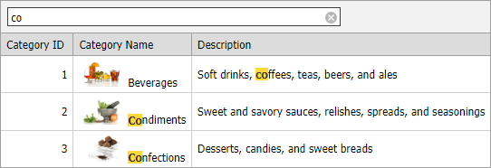

<!-- default badges list -->
[](https://supportcenter.devexpress.com/ticket/details/T222691)
[](https://docs.devexpress.com/GeneralInformation/403183)
<!-- default badges end -->

# Grid View for ASP.NET Web Forms - How to highlight search text placed inside a DataItem template
<!-- run online -->
**[[Run Online]](https://codecentral.devexpress.com/t222691/)**
<!-- run online end -->

Search results contained in templates are not highlighted. This example demonstrates how to highlight them manually. 



## Implementation Details

In this example, [DataItemTemplate](https://docs.devexpress.com/AspNet/DevExpress.Web.GridViewDataColumn.DataItemTemplate) contains the [ASPxLabel](https://docs.devexpress.com/AspNet/DevExpress.Web.ASPxLabel) control. 

```aspx
<dx:GridViewDataTextColumn FieldName="CategoryName" >
    <DataItemTemplate>
        <dx:ASPxImage ID="ASPxImage1" runat="server" ShowLoadingImage="true" Width="50" ImageUrl='<%# string.Format("~/Images/{0}.jpg", Eval("CategoryID")) %>' />
        <dx:ASPxLabel ID="label" runat="server" Text='<%# Eval("CategoryName") %>' EncodeHtml="false" OnDataBound="label_DataBound" />
    </DataItemTemplate>
</dx:GridViewDataTextColumn>
```

The `ASPxLabel.DataBound` event handler looks for the search text and applies the `dxgvHL` CSS class to the found text.

```csharp
protected void label_DataBound(object sender, EventArgs e) {
    ASPxLabel label = sender as ASPxLabel;
    label.Text = HighlightSearchText(label.Text, gridView.SearchPanelFilter);
}
public static string HighlightSearchText(string source, string searchText) {
    if (string.IsNullOrWhiteSpace(searchText))
        return source;
    var regex = new Regex(Regex.Escape(searchText), RegexOptions.IgnoreCase);
    if (regex.IsMatch(source))
        return string.Format("<span>{0}</span>", regex.Replace(source, "<span class='dxgvHL'>$0</span>"));
    return source;
}
```

> [!NOTE]
> This example illustrates how to process simple requests. If you create a composite criterion, it is necessary to perform additional operations to parse the search text.


## Files to Review

* [Default.aspx](./CS/Default.aspx) (VB: [Default.aspx](./VB/Default.aspx))
* [Default.aspx.cs](./CS/Default.aspx.cs) (VB: [Default.aspx.vb](./VB/Default.aspx.vb))
